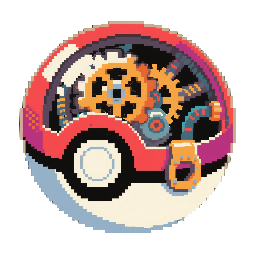

# Create Cobblemon Potion

 

---

**[English](#english) | [中文](#中文)**

---

## English

### Introduction
This mod is an addon for **Create** and **Cobblemon**, designed to integrate Cobblemon's potion brewing system with Create's automation capabilities. Now you can produce Pokémon potions on a massive scale using the power of Create contraptions!

### Dependencies
*   **Minecraft:** [1.21.1]
*   **NeoForge:** [21.1.129]
*   **Create:** [6.0.4]
*   **Cobblemon:** [1.6.1]
*   **(Optional but Recommended)** JEI/EMI/REI for recipe viewing.

### Features
1.  **Automated Brewing:** Brew Cobblemon's medicinal brews using Create's **Mechanical Mixer** and **Basin**. Check JEI/REI/EMI for the specific recipes!
2.  **Fluid Storage:** Store the brewed Cobblemon potions (now in fluid form!) in Create's **Fluid Tanks**. Manage your potion reserves efficiently.
3.  **Automated Bottling:** Use Create's **Spout** to fill **Glass Bottles** with your custom potion fluids, turning them into Cobblemon's usable potion items.

### How to Use
1.  Check JEI/REI/EMI for the new **Mixing** recipes that take potion ingredients and produce potion fluids.
2.  Set up a Create **Basin** with a **Mechanical Mixer** above it and a **Blaze Burner** (heated) below it. Input the required fluid (e.g., water) and items to start brewing.
3.  Pump the resulting potion fluid into **Fluid Tanks** for storage.
4.  Use a **Spout** connected to your fluid storage to fill **Glass Bottles** on a **Depot** or **Belt** to get the final Cobblemon potion items.

### Installation
1.  Ensure you have installed **Minecraft**, **NeoForge**, **Create**, and **Cobblemon** of the compatible versions.
2.  Download the latest JAR file of this mod.
3.  Place the downloaded JAR file into your Minecraft instance's `mods` folder.
4.  Launch the game!

### ToDo / Planned Features
*   Add status effects to the fluid versions of the potions (visual/in-world effects).
*   Allow players to drink potions directly from buckets (perhaps with different effects/durations?).
*   Possibly add compatibility for other Cobblemon healing items.

### Issues & Feedback
If you encounter any bugs or have suggestions, please report them on the [GitHub Issues Page](https://github.com/buggzd/create_cobblemon_potion/issues)!

---

## 中文

### 介绍
本模组是 **机械动力 (Create)** 与 **方块宝可梦 (Cobblemon)** 的附属模组，旨在将 Cobblemon 的药水酿造系统与 Create 的自动化能力相结合。现在你可以利用机械动力的装置大规模生产宝可梦药水了！

### 依赖项
*   **Minecraft:** [1.21.1]
*   **NeoForge:** [21.1.129]
*   **Create:** [6.0.4]
*   **Cobblemon:** [1.6.1]
*   **(可选但推荐)** JEI/EMI/REI 用于查看配方。

### 特性
1.  **动力酿造:** 使用 Create 的 **动力搅拌器 (Mechanical Mixer)** 和 **工作盆 (Basin)** 来酿造 Cobblemon 的药酿。请在 JEI/REI/EMI 中查看具体配方！
2.  **流体存储:** 将酿造好的 Cobblemon 药水（现在是流体形式！）存储在 Create 的 **流体储罐 (Fluid Tank)** 中。高效管理你的药水储备。
3.  **自动装瓶:** 使用 Create 的 **注液器 (Spout)** 将你的自定义药水流体注入**玻璃瓶 (Glass Bottle)**，将得到可用的 Cobblemon 药水物品。

### 使用方法
1.  在 JEI/REI/EMI 中查看新增的**搅拌 (Mixing)** 配方，这些配方使用药水原料生产药水流体。
2.  设置一个 Create **工作盆 (Basin)**，上方放置**动力搅拌器 (Mechanical Mixer)**，下方放置**烈焰人燃烧室 (Blaze Burner)**（加热状态）。投入所需的基础流体（例如水）和物品即可开始酿造。
3.  将产出的药水流体用泵抽入**流体储罐 (Fluid Tank)** 进行存储。
4.  使用连接到流体储罐的**注液器 (Spout)**，将流体注入放在**置物台 (Depot)** 或**传送带 (Belt)** 上的**玻璃瓶 (Glass Bottle)**，即可获得最终的 Cobblemon 药水物品。

### 安装
1.  确保你已经安装了兼容版本的 **Minecraft**, **NeoForge**, **Create** 和 **Cobblemon**。
2.  下载本模组最新的 JAR 文件。
3.  将下载的 JAR 文件放入你的 Minecraft 实例的 `mods` 文件夹中。
4.  启动游戏！

### ToDo / 计划特性
*   为流体药水添加状态效果（视觉或世界内效果）。
*   允许玩家直接饮用桶装药水（也许效果/持续时间不同？）。
*   可能添加对其他 Cobblemon 治疗物品的兼容。

### 问题与反馈
如果你遇到任何 Bug 或有功能建议，请在 [GitHub Issues 页面](https://github.com/buggzd/create_cobblemon_potion/issues) 提交反馈！

### Dependencies
*   ...
*   **Create:**  - Licensed under [CC BY-NC-SA 4.0](https://creativecommons.org/licenses/by-nc-sa/4.0/)
*   **Cobblemon:**  - Licensed under [MPL 2.0](https://www.mozilla.org/en-US/MPL/2.0/)
*   ...
