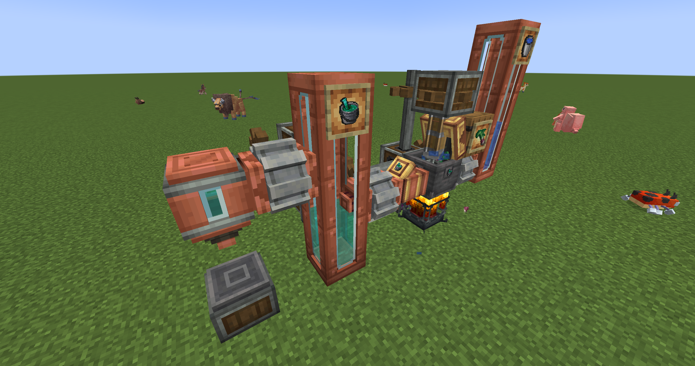

# Mixing Recipes

One of the core features of this addon is enabling players to use the **Mechanical Mixer** from the **Create** mod to craft potion fluids from the **`Cobblemon`** mod. This opens up new possibilities for automating the production of Pokémon recovery items.

All added mixing recipes are designed strictly based on `Cobblemon`'s original medicinal brewing recipes. Therefore, before gathering materials, please consult the official `Cobblemon` Wiki to understand the base liquid and ingredients required for specific potions:

* **Cobblemon Medicinal Brew Recipe Reference:** [Cobblemon Wiki - Medicinal Brew](https://wiki.cobblemon.com/index.php/Medicinal_Brew)

> **Enhanced Yield Notice:**
>
> Unlike standard `Cobblemon` brewing (where 1 primary ingredient + base potion/water typically yields 3 finished potions, i.e., 750mB), using the Create Mechanical Mixer offers enhanced efficiency:
>
> **1 Primary Ingredient + 1000mB Base Fluid → 1000mB Corresponding Potion Fluid (Equivalent to 4 potions)**
>
> This change is intended to encourage players to utilize the powerful automation capabilities of Create for building potion production lines.

## Mechanical Mixing Steps:

To brew Cobblemon potion fluids using Create machinery, follow these steps:

1. **Prepare Create Machinery:**
   * Place down a **Basin**.
   * Position a **Mechanical Mixer** above the Basin.
   * Place a **Blaze Burner** beneath the Basin and provide it with fuel (e.g., Coal, Blaze Powder). The vast majority of Cobblemon potion recipes require the `heated` condition.
2. **Add Base Fluid:**
   * Determine the required base fluid based on the `Cobblemon` recipe. For the first step of most potions, this is typically **Medicinal Brew (`cobblemon:medicinal_brew`)**, corresponding to Medicinal Brew in cobblemon brewing.
   * Using Fluid Pipes, Tanks, or directly with a bucket, insert **250mB** of the base fluid into the Basin.
3. **Add Brewing Ingredient:**
   * Add the **solid ingredient** required by the `Cobblemon` brewing recipe (e.g., `cobblemon:oran_berry` for Potion into the Basin via hoppers, belts, or manually. **Only 1 ingredient is needed per mixing cycle.**
4. **Start Mixing:**
   * Provide rotational power to the Mechanical Mixer (e.g., using Cogwheels, Shafts connected to a power source).
   * Ensure the Blaze Burner is in a heated state.
   * The Mixer will automatically lower and begin mixing.
5. **Collect Potion Fluid:**
   * Once mixing is complete, the base fluid and ingredient in the Basin will transform into **1000mB** of the corresponding **Cobblemon Potion Fluid** (e.g., `create_cobblemon_potion:potion_source`).
   * You can use Create's **Fluid Pipes** and **Smart Fluid Pipes** (with filters set) to extract the specific potion fluid.
   * Store the extracted fluid in **Fluid Tanks** for later use.
6. **Bottling (Obtaining Items):**
   * To obtain the actual usable `Cobblemon` potion **items**, you need to bottle the potion fluid.
   * Set up a **Spout** with a belt or depot underneath to supply **Glass Bottles**.
   * Pipe the corresponding potion fluid into the Spout.
   * The Spout will automatically fill one Glass Bottle with **250mB** of the potion fluid, producing the corresponding `Cobblemon` potion item (e.g., `cobblemon:potion`).

(A Simple medicinal brew Example)

<figure><figcaption>
medicinal brew
</figcaption></figure>

\
By following these steps, you can efficiently and automatically produce large quantities of Cobblemon potions using the power of Create!
