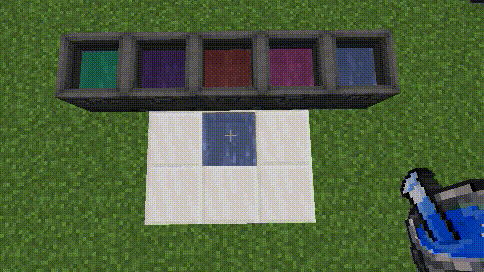

### **Create Cobblemon Potions Mod Features Wiki**

#### **Potion Fluid Effects**

When a player or other living entity comes into contact with Pokémon potion fluid blocks added by this mod (including both source blocks and flowing blocks), they will receive corresponding status effects (Buffs) based on the type of potion. Higher-tier potions generally provide stronger effects.

**Healing-Type Potion Effects:**

*   **Medicinal Brew:** No contact effect.
*   **Potion:** Grants **Regeneration I** upon contact.
*   **Super Potion:** Grants **Regeneration II** upon contact.
*   **Hyper Potion:** Grants **Regeneration III** upon contact.
*   **Max Potion:** Grants **Regeneration IV** upon contact.

*(More types of potion effects, such as status healing or PP restoration, may be added in the future)*

---

#### **Potion Fluid Degradation (Volatilization)**

Pokémon potion fluids placed directly into the world without being contained (e.g., in buckets or tanks) will gradually lose their potency due to environmental exposure.

**Mechanism:**

*   Potion fluid blocks respond to Minecraft's **Random Tick** system.
*   Each time a block receives a random tick, there is a chance it will **degrade**.
*   Degradation means the block transforms into the next lower tier of potion fluid block. For example, a **Max Potion** fluid block will eventually degrade into a **Hyper Potion** fluid block, which will then degrade into a Super Potion block, and so on.
*   Higher-tier potions degrade **more quickly** (i.e., they require fewer average random ticks to trigger degradation).

**(Visual Demonstration)**

**Average Degradation Time per Potion Type:**

The times below are based on the average number of random ticks received by the block. On average, a random tick occurs for a specific block approximately every **68.27 seconds**. Note that this is an average, and actual degradation times will vary randomly.

*   **Medicinal Brew:** Degrades after an average of approx. **240** random ticks (approx. **4.5 hours**). *(Likely degrades into Water or another base fluid)*
*   **Potion:** Degrades into **Medicinal Brew** after an average of approx. **120** random ticks (approx. **2.25 hours**).
*   **Super Potion:** Degrades into **Potion** after an average of approx. **60** random ticks (approx. **1.1 hours**).
*   **Hyper Potion:** Degrades into **Super Potion** after an average of approx. **30** random ticks (approx. **34 minutes**).
*   **Max Potion:** Degrades into **Hyper Potion** after an average of approx. **15** random ticks (approx. **17 minutes**).

---
