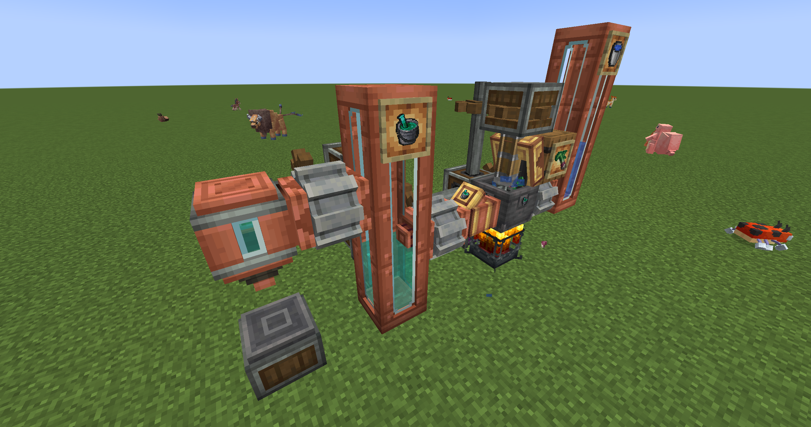

# 搅拌合成

本模组的核心功能之一是允许玩家使用 **机械动力 (Create)** 模组的搅拌器来制作 **`方块宝可梦` (Cobblemon)** 模组中的药水流体。这为你自动化生产宝可梦恢复道具提供了全新的可能性。

所有添加的动力搅拌配方都是严格依据 `Cobblemon` 原版的药水酿造配方进行设计的。因此，在准备材料前，请务必查阅 `Cobblemon` 官方 Wiki 以了解制作特定药水所需的基础液体和素材：

* **Cobblemon 药水酿造配方参考:** [Cobblemon Wiki - Medicinal Brew](https://wiki.cobblemon.com/index.php/Medicinal_Brew)

> **产出效率提升提示：**
>
> 与 `Cobblemon` 原版酿造不同（通常 1 个主要素材 + 基础药水（水） 产出 3 瓶成品药水，即 750mB），使用机械动力搅拌可以获得更高的产出效率：
>
> **1 个主要素材 + 1000mB 基础流体 → 1000mB 对应药水流体（相当于 4 瓶）**
>
> 这个改动是为了鼓励玩家利用机械动力的强大自动化能力来搭建药水生产线。

## 动力搅拌步骤：

要在机械动力中酿造 Cobblemon 药水流体，请按照以下步骤操作：

1. **准备机械动力设备：**
   * 放置一个 **搅拌盆 (Basin)**。
   * 在搅拌盆上方放置一个 **动力搅拌器 (Mechanical Mixer)**。
   * 在搅拌盆下方放置一个 **烈焰人燃烧室 (Blaze Burner)** 并为其提供燃料（例如煤炭）。绝大多数 Cobblemon 药水配方都需要加热 (`heated`) 条件。
2. **放入基础流体：**
   * 根据 `Cobblemon` 配方确定所需的基础流体。对于大部分药水的第一步，这通常是 **药酿 (`cobblemon:medicinal_brew`)**，对应原版酿造中的药酿。
   * 使用流体管道、储罐或直接用桶，将 **1000mB** 的基础流体注入搅拌盆中。
3. **添加酿造素材：**
   * 将 `Cobblemon` 酿造配方中所需的 **固体素材**（例如，制作伤药的 `cobblemon:oran_berry` 通过漏斗、传送带扔入搅拌盆中，或者手动投入。**每次搅拌只需 1 个素材**。
4. **启动搅拌：**
   * 为动力搅拌器提供旋转动力（例如，使用齿轮、传动轴连接到动力源）。
   * 确保烈焰人燃烧室处于加热状态。
   * 搅拌器会自动下降并开始搅拌。
5. **收集药水流体：**
   * 搅拌完成后，搅拌盆中的基础流体和素材会转化为 **1000mB** 的对应 **Cobblemon 药水流体**（例如，`create_cobblemon_potion:potion_source`）。
   * 你可以使用机械动力的 **流体管道 (Fluid Pipe)** 和 **智能流体管道 (Smart Fluid Pipe)**（设置过滤）将特定的药水流体抽出。
   * 将抽出的流体存储在 **流体罐 (Fluid Tank)** 中以备后用。
6. **装瓶（获得物品）：**
   * 要获得玩家可以实际使用的 `Cobblemon` 药水**物品**，你需要将药水流体装入瓶中。
   * 设置一个 **注液器 (Spout)**，下方放置传送带或仓库用于放置 **玻璃瓶 (Glass Bottle)**。
   * 将对应的药水流体通过管道输入注液器。
   * 注液器会自动将 **250mB** 的药水流体装入一个玻璃瓶，产出对应的 `Cobblemon` 药水物品（例如 `cobblemon:potion`）。

(一个简单的药酿流水线示例)

<figure><figcaption>
药酿流水线
</figcaption></figure>

\
通过以上步骤，你就可以利用机械动力高效、自动化地生产大量 Cobblemon 药水了！

## 全自动药剂工厂示例
<iframe src="//player.bilibili.com/player.html?isOutside=true&aid=114328338498842&bvid=BV1gZdiYKEsx&cid=29383789897&p=1" scrolling="no" border="0" frameborder="no" framespacing="0" allowfullscreen="true"></iframe>


示例


