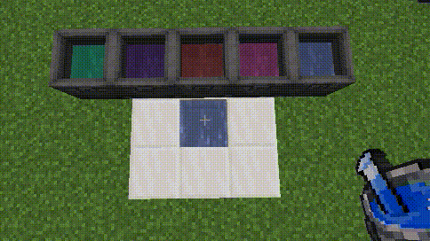

### **药水流体效果**
> 提示：此特性在v1.0.1后加入

当玩家或其他生物实体接触到由本模组添加的宝可梦药水流体方块（包括源方块和流动方块）时，会根据药水的种类获得相应的状态效果 (Buff)。药水的等级越高，提供的效果通常也越强力。

**治疗类药水效果:**

*   **药酿 (Medicinal Brew):** 无接触效果。
*   **伤药 (Potion):** 接触时获得 **再生 I** (Regeneration I) 效果。
*   **好伤药 (Super Potion):** 接触时获得 **再生 II** (Regeneration II) 效果。
*   **厉害伤药 (Hyper Potion):** 接触时获得 **再生 III** (Regeneration III) 效果。
*   **全满药 (Max Potion):** 接触时获得 **再生 IV** (Regeneration IV) 效果。

*(未来可能会添加更多类型的药水效果，如状态治疗、PP回复等)*

---

#### **药水流体变质 (药效挥发)**

直接放置在世界中、没有使用容器（如桶或储罐）盛装的宝可梦药水流体，会因暴露在环境中而逐渐失去效力。

**机制:**

*   药水方块会响应 Minecraft 的**随机刻 (Random Tick)** 系统。
*   每次接收到随机刻时，药水方块有一定几率**降级**。
*   降级意味着它会转变为低一级的药水方块。例如，**全满药 (Max Potion)** 流体方块在一段时间后会降级为 **厉害伤药 (Hyper Potion)** 流体方块，厉害伤药会降级为好伤药，以此类推。
*   药水等级越高，其降级的**频率越快**（即需要更少的平均随机刻数来触发降级）。

**(效果演示)**

**各类药水平均挥发/降级时间:**

以下时间基于方块接收到的平均随机刻次数。一次随机刻大约平均发生在每个方块上每 **68.27 秒**。请注意这是平均值，实际降级时间会有随机波动。

*   **药酿 (Medicinal Brew):** 平均约 **240 次**随机刻后降级 (约 **4.5 小时**)。*(最终可能降级为水方块或其他基础流体)*
*   **伤药 (Potion):** 平均约 **120 次**随机刻后降级为 **药酿 (Medicinal Brew)** (约 **2.25 小时**)。
*   **好伤药 (Super Potion):** 平均约 **60 次**随机刻后降级为 **伤药 (Potion)** (约 **1.1 小时**)。
*   **厉害伤药 (Hyper Potion):** 平均约 **30 次**随机刻后降级为 **好伤药 (Super Potion)** (约 **34 分钟**)。
*   **全满药 (Max Potion):** 平均约 **15 次**随机刻后降级为 **厉害伤药 (Hyper Potion)** (约 **17 分钟**)。

